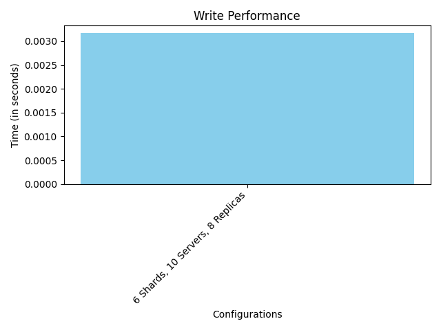
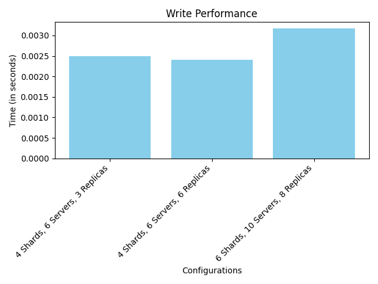
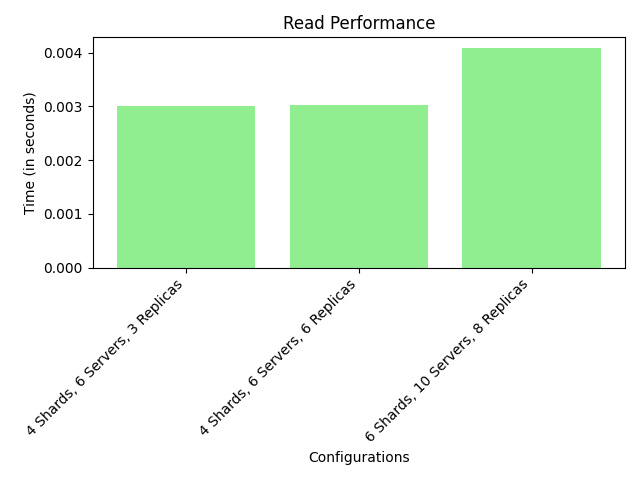

# <div align="center">GalaxyDB</div>

> GalaxyDB is a scalable database as a service using sharding written in Go. It is the descendent of our friendly old [Traffic Wizard](https://github.com/chirag-ghosh/traffic-wizard). RIP mate. Like it's parent, this cute munchkin is also religious in it's own way and follows the New Testament found [here](bible_new_testament.pdf). Lastly, this is the second assignment for Distributed Systems course taken by [Dr. Sandip Chakraborty](https://cse.iitkgp.ac.in/~sandipc/) for Spring-2024.

### Production

1. Ensure that you have `make`, `docker` and `docker-compose` installed.
2. In the project root folder, run `make`
3. To stop the containers, run `make stop`

---

```markdown
# Distributed Database Performance Analysis

This README documents the performance analysis of a distributed database system under different configurations. The analysis focuses on measuring the average read and write times to understand the impact of varying the number of shards, servers, and replicas.

## System Configuration

The distributed database system was tested under three different configurations to evaluate its performance:

1. Configuration 1: 4 Shards, 6 Servers, 3 Replicas
2. Configuration 2: 4 Shards, 6 Servers, 6 Replicas
3. Configuration 3: 6 Shards, 10 Servers, 8 Replicas

Each configuration was subjected to 10,000 write operations followed by 10,000 read operations to measure the system's performance.

## Methodology

The test setup involved initializing the distributed database with the specified configuration, performing the write operations, followed by the read operations. The average time taken for these operations was recorded to analyze the system's performance under each configuration.

## Results

Below are the results showing the average read and write times for each configuration. The results are also visualized in the form of graphs to provide a clear comparison.

### Configuration 1: 4 Shards, 6 Servers, 3 Replicas

- Average Write Time: 0.001972928476333618 seconds
- Average Read Time: 0.002262153697013855 seconds


### Configuration 2: 4 Shards, 6 Servers, 6 Replicas

- Average Write Time: 0.0023517378568649293 seconds
- Average Read Time: 0.0033333791494369507 seconds


### Configuration 3: 6 Shards, 10 Servers, 8 Replicas

- Average Write Time: 0.0020610308408737185 seconds
- Average Read Time: 0.0025781458139419555 seconds




### Combined:


```

